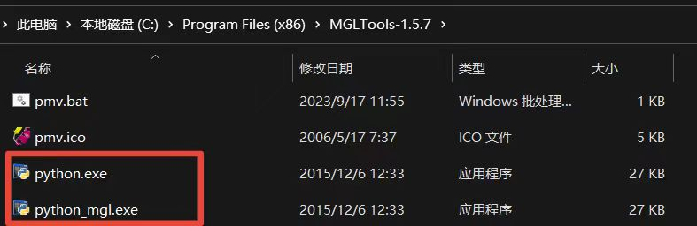
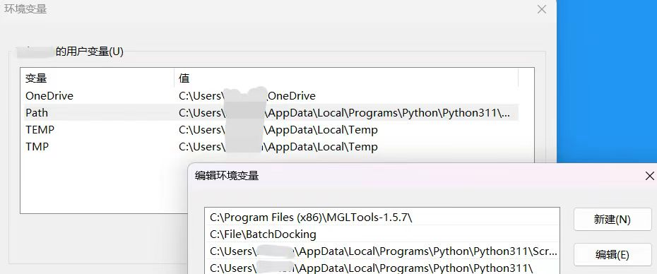
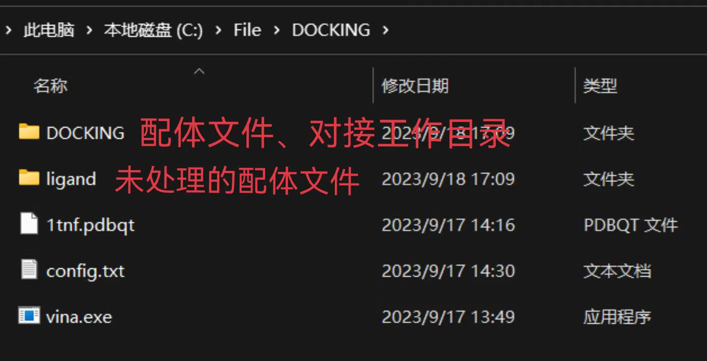
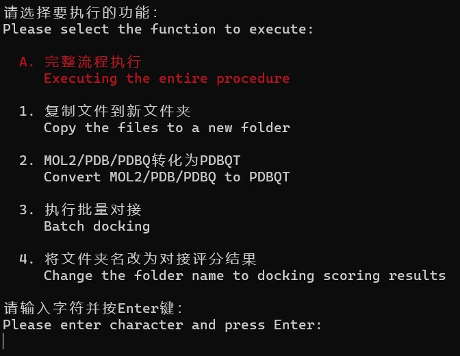
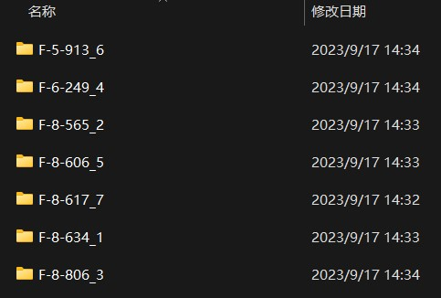

# Readme.md
### BatchDocking
    

**BatchDocking是一个用于快速高通量进行分子对接的辅助软件，旨在为在计算机操作方面遇到困难的科研人员提供便利。它通过调用Autodock Tools和Autodock Vina来完成对接的部分。**

## 使用前必读
如果你使用BatchDocking完成了科研工作并发表了相关文章，请确保在参考文献中引用了相关软件的文献。同时，在正文中也请提及BatchDocking的开源地址。

#### 引用文献
+ ADT
    + Michel F. Sanner. Python: A Programming Language for Software Integration and Development. J. Mol. Graphics Mod., 1999, Vol 17, February. pp57-61
+ AutoLigand
    + Harris R, Olson AJ, Goodsell DS. Proteins. (2008) 70 1506.
+ AutoDock Vina
    * J. Eberhardt, D. Santos-Martins, A. F. Tillack, and S. Forli. (2021). AutoDock Vina 1.2.0: New Docking Methods, Expanded Force Field, and Python Bindings. Journal of Chemical Information and Modeling.
    * O. Trott, A. J. Olson, AutoDock Vina: improving the speed and accuracy of docking with a new scoring function, efficient optimization and multithreading, Journal of Computational Chemistry 31 (2010) 455-461

## 使用方法
>受限于作者水平，该教程可能会有事实错误，请于issus进行讨论

#### （1）安装依赖软件
BatchDocking依赖于Autodock Tools和Autodock Vina。请确保在使用之前已经正确安装软件。下载地址如下：

[Autodock Tools](https://ccsb.scripps.edu/mgltools/downloads/)

[Autodock Vina](https://vina.scripps.edu/downloads/)

为正确预处理蛋白质，可能需要使用PyMOL软件

[PyMOL](https://pymol.org/)
#### （2）创建副本
为MGLTools安装路径下的python.exe创建一个副本，并重命名为python_mgl.exe。将下载的Vina软件重命名为Vina.exe。

#### （3）配置环境变量
打开环境变量配置（开始菜单→设置→系统→关于→高级系统设置→环境变量），将python_mgl.exe和Vina.exe所在的路径添加到用户变量Path中。

#### （4）准备对接文件
需要预处理好的蛋白质文件（PDBQT）配体文件（MOL2/PDB/PDBQ）和用于配置对接参数的Config.txt文件，**具体内容见附录**。推荐的文件组织方式如下：

#### （5）使用BatchDocking进行对接
一般地，进入软件后输入A，选择”完整流程执行“，根据软件内提示输入文件或文件路径即可。

#### （6）结果呈现
结果（结合能评分、配体的位置信息output.pdbqt）会保存在对接工作路径下的每一个子文件夹中。每一个文件夹的名称会被修改为如”F-8-806_3“，表示该文件夹内的配体与蛋白质结合能为-8.806kcal/mol，用于快速筛选结合能力强的配体。

## 附录
*施工中*  
